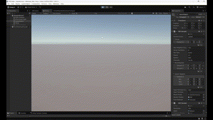
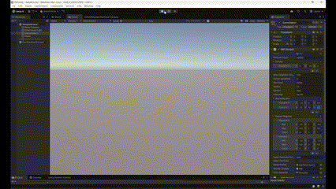

# PBF in Unity

Replicate [Position Based Fluids](https://mmacklin.com/pbf_sig_preprint.pdf) by M. Macklin and M. Muller in Unity using C# scripts and compute shaders.

## Results

Dam break

External Forces

Particles Injection

Interact with Mesh

## Reference

Miles Macklin and Matthias Müller. 2013. Position based fluids. ACM Trans. Graph. 32, 4, Article 104 (July 2013), 12 pages. https://doi.org/10.1145/2461912.2461984
